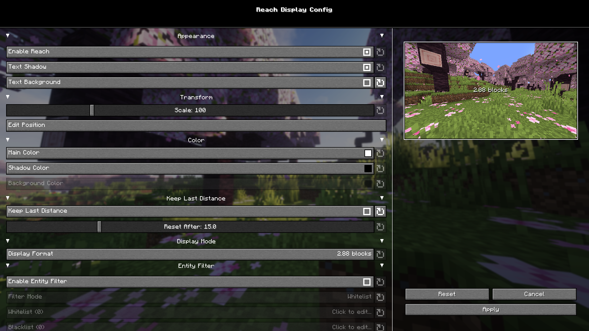

  

---

## 📌 About

**Reach Display** is a client-side HUD mod that displays the distance of your latest entity hit.

It is useful for PvP, testing, or simply understanding how far your hits are landing.  
No server-side installation is required.

## ✨ Features

- 📏 Displays your latest hit distance on the HUD
- 🎨 Customizable text, shadow, and background colors
- 🌈 Distance-based color bands
  - Add or remove distance color bands
  - Configure colors per distance range
- 🧍 Entity filter support
  - Enable or disable filtering
  - Whitelist mode
  - Blacklist mode
- 🪟 Adjustable HUD position
  - Drag-based position editor
  - Respects GUI scale and window resizing
- 🔍 Adjustable HUD scale
- 🔄 Multiple display formats:
  - `2.88`
  - `2.88 blocks`
  - `2.88 M`
- ⏱️ Optional keep-last-distance behavior
  - Keep the last hit distance
  - Or reset after a configurable delay
- ⚙️ In-game configuration screen
- 🖱️ Popup color picker with ARGB hex editing
- 💻 Fully client-side

## 🖼️ Screenshots

### 🎮 In-Game Preview

  

### ⚙️ Configuration Screen

  

## 🛠️ Configuration

You can configure the mod through Mod Menu, or through the mod's configuration screen if opened manually.

Available options include:

- HUD visibility
- Text shadow
- Text background
- HUD scale
- HUD position
- Main color
- Shadow color
- Background color
- Display format
- Keep-last-distance behavior
- Reset delay
- Entity whitelist / blacklist
- Distance-based color bands

## 📦 Installation

Requires:

- **Fabric Loader**
- **Fabric API**

Optional:

- **Mod Menu** — recommended for opening the configuration screen easily

---